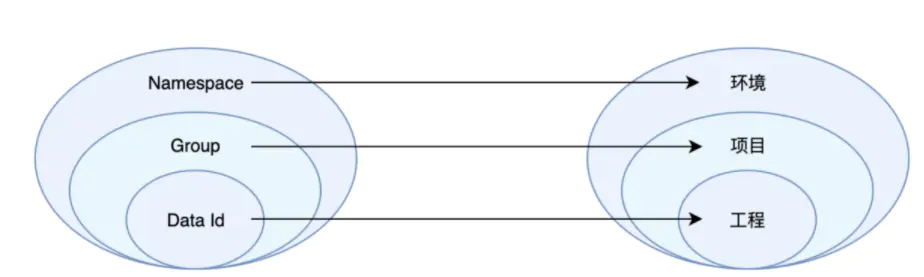

## 第一课 Nacos
## Nacos服务注册
### 版本
https://github.com/alibaba/spring-cloud-alibaba/wiki/%E7%89%88%E6%9C%AC%E8%AF%B4%E6%98%8E

### 父级项目
```xml
<dependencyManagement>
        <dependencies>
            <dependency>
                <groupId>org.springframework.cloud</groupId>
                <artifactId>spring-cloud-dependencies</artifactId>
                <version>2020.0.1</version>
                <type>pom</type>
                <scope>import</scope>
            </dependency>

            <dependency>
                <groupId>com.alibaba.cloud</groupId>
                <artifactId>spring-cloud-alibaba-dependencies</artifactId>
                <version>2021.1</version>
                <type>pom</type>
                <scope>import</scope>
            </dependency>
        </dependencies>
    </dependencyManagement>

    <dependencies>
        <dependency>
            <groupId>org.projectlombok</groupId>
            <artifactId>lombok</artifactId>
            <optional>true</optional>
        </dependency>

        <dependency>
            <groupId>org.springframework.cloud</groupId>
            <artifactId>spring-cloud-starter-bootstrap</artifactId>
        </dependency>
    </dependencies>
```

### 服务注册
```xml
<dependencies>
        <dependency>
            <groupId>com.alibaba.cloud</groupId>
            <artifactId>spring-cloud-starter-alibaba-nacos-discovery</artifactId>
        </dependency>

        <dependency>
            <groupId>org.springframework.boot</groupId>
            <artifactId>spring-boot-starter-web</artifactId>
        </dependency>
    </dependencies>
```

```java
@EnableDiscoveryClient
@SpringBootApplication
public class OrderApplication {
    public static void main(String[] args) {
        SpringApplication.run(OrderApplication.class, args);
    }
}

```
### 错误解决
```
java.lang.IllegalArgumentException: Param 'serviceName' is illegal, serviceName is blank
```

加上依赖：
```xml
<dependency>
    <groupId>org.springframework.cloud</groupId>
    <artifactId>spring-cloud-starter-bootstrap</artifactId>
</dependency>

```

### 启动微服务
> nacos registry, DEFAULT_GROUP service-order 192.168.3.39:8000 register finished

```
-Dserver.port=8002
```

配置多个启动方式，观察nacos注册中心面板的变化

## Nacos服务治理

> java.net.UnknownHostException: service-store

在微服务调用的时候出现的，意思是找不到服务

添加loadBalance：
```xml
<dependency>
    <groupId>org.springframework.cloud</groupId>
    <artifactId>spring-cloud-starter-loadbalancer</artifactId>
</dependency>
```

注册 RestTemplate:
```java
@LoadBalanced
@Bean
public RestTemplate restTemplate() {
    return new RestTemplate();
}
```

注册失败错误
> com.alibaba.nacos.api.exception.NacosException: failed to req API:/nacos/v1/ns/instance after all servers

重启nacos即可

## Nacos配置中心

> java.lang.IllegalArgumentException: Could not resolve placeholder 'env.ip' in value "${env.ip}"

出现这个错误是因为配置项不存在，那么我们应该给与一个默认值,在配置后面输入一个 : 类似于 ${env:ip:},那么就默认了一个空的字符串


### 基本配置
数据库配置：nacos/conf/application.properties  可以进行数据库的配置
- spring.datasource.platform=mysql
- db.num=1
- db.url.0=jdbc:mysql://127.0.0.1:3306/nacos?characterEncoding=utf8&connectTimeout=1000&socketTimeout=3000&autoReconnect=true&useUnicode=true&useSSL=false&serverTimezone=UTC
- db.user.0=root
- db.password.0=123456

配置完成之后，新建数据库nacos，导入数据文件 nacos-mysql.sql

重启nacos

### 动态刷新
在Controller上面加上@RefreshScope

### dataID格式
`${prefix}-${spring.profiles.active}.${file-extension}`

### Group分组

配置 group，可以将业务类似的配置文件归为一组

### Namespace

namespace里面可以写多个dataID的文件，通过 spring.profile.active 可以区分不同的配置文件

`namespace - group - active` 可以组合出很多种配置

> 注意：在固定的服务里面， prefix必须是当前服务的名称，比如 service-goods，如果prefix改成其他的服务名称，则读取不到配置值

### 共享配置 shared-configs[0]
### extension-configs

## Openfeign远程调用

### 集成方式
```xml
<dependency>
    <groupId>org.springframework.cloud</groupId>
    <artifactId>spring-cloud-starter-openfeign</artifactId>
</dependency>
```

启动类加上注解：`@EnableFeignClients`

FeignConfig
```java
import feign.Feign;
import feign.Logger;
import feign.Retryer;
import org.springframework.boot.autoconfigure.condition.ConditionalOnClass;
import org.springframework.boot.context.properties.ConfigurationProperties;
import org.springframework.context.annotation.Bean;
import org.springframework.context.annotation.Configuration;

import java.util.concurrent.TimeUnit;

@ConditionalOnClass(Feign.class)
@ConfigurationProperties("feign.httpclient.enable")
@Configuration
public class FeignConfig {

   

    /**
     * NONE：默认的，不显示任何日志;
     * BASIC：仅记录请求方法、URL、响应状态码及执行时间;
     * HEADERS：除了BASIC中定义的信息之外，还有请求和响应的头信息;
     * FULL：除了HEADERS中定义的信息之外，还有请求和响应的正文及元数据。
     */
    @Bean
    Logger.Level feignLoggerLevel() {
        return Logger.Level.FULL;
    }

}
```
### 重试机制

```java
 /**
     * 创建重试器 （重试周期（50毫秒），最大重试周期（2000毫秒），最多尝试次数 3次 ）
     * feign没有采用线性的重试机制而是采用的是一种指数级（乘法）的重试机制 每次重试时间  当前重试时间*= 1.5
     * @FeignClient(configuration = FeignConfig.class) 进行配置
     */
    @Bean
    public Retryer retryer() {
        return new Retryer.Default(50, TimeUnit.SECONDS.toMillis(2), 3);
    }
```
### 超时时间设置

错误示范：
> Failed to bind properties under 'feign.client.config.connecttimeout' to org.springframework.cloud.openfeign.FeignClientProperties$FeignClientConfiguration:
> Reason: No converter found capable of converting from type [java.lang.Integer] to type [org.springframework.cloud.openfeign.FeignClientProperties$FeignClientConfiguration]

```yaml
feign:
  client:
    config:
      default:
        connectTimeout: 5000  #指的是建立连接所用的时间，适用于网络状况正常的情况下,两端连接所用的时间
        readTimeout: 5000   #指的是建立连接后从服务器读取到可用资源所用的时间
```

### 日志增强

```java
@Component
@Configuration
public class FeignConfig {

    /** NONE：默认的，不显示任何日志;
     * BASIC：仅记录请求方法、URL、响应状态码及执行时间;
     * HEADERS：除了BASIC中定义的信息之外，还有请求和响应的头信息;
     * FULL：除了HEADERS中定义的信息之外，还有请求和响应的正文及元数据。
     */
    @Bean
    Logger.Level feignLoggerLevel() {
        return Logger.Level.FULL;
    }

}
```

### 使用Okhttp
- 支持 HTTP/2 协议。
- 允许连接到同一个主机地址的所有请求，提高请求效率。
- 共享Socket，减少对服务器的请求次数。
- 通过连接池，减少了请求延迟。
- 缓存响应数据来减少重复的网络请求。
- 减少了对数据流量的消耗。
- 自动处理GZip压缩。

```xml
<dependency>
    <groupId>io.github.openfeign</groupId>
    <artifactId>feign-okhttp</artifactId>
</dependency>
```

```yaml
feign:
    httpclient:
        enabled: false
      okhttp:
        enabled: true
```

FeignOkhttpConfig
```java
@Configuration
@ConditionalOnClass({OkHttpClient.class})
@ConditionalOnProperty({"feign.okhttp.enabled"})
public class FeignOkhttpConfig {

    @Bean
    public okhttp3.OkHttpClient okHttpClient(OkhttpProperties okhttpProperties) {
        return new okhttp3.OkHttpClient.Builder()
                //设置连接超时
                .connectTimeout(okhttpProperties.getConnectTimeout(), TimeUnit.MILLISECONDS)
                //设置读超时
                .readTimeout(okhttpProperties.getReadTimeout(), TimeUnit.MILLISECONDS)
                //是否自动重连
                .retryOnConnectionFailure(true)
                .connectionPool(new ConnectionPool())
                .addInterceptor(new OkHttpLogInterceptor())
                //构建OkHttpClient对象
                .build();
    }
}
```

OkhttpProperties
```java
import lombok.Data;
import org.springframework.boot.context.properties.ConfigurationProperties;
import org.springframework.stereotype.Component;

@Data
@Component
@ConfigurationProperties(prefix = "feign.okhttp")
public class OkhttpProperties {

    private Long connectTimeout;
    private Long readTimeout;

}
```

OkHttpLogInterceptor

```java
import lombok.extern.log4j.Log4j2;
import lombok.extern.slf4j.Slf4j;
import okhttp3.Interceptor;
import okhttp3.Request;
import okhttp3.Response;
import okhttp3.ResponseBody;

import java.io.IOException;

@Slf4j
public class OkHttpLogInterceptor implements Interceptor {
    @Override
    public Response intercept(Interceptor.Chain chain) throws IOException {
        //这个chain里面包含了request和response，所以你要什么都可以从这里拿
        Request request = chain.request();
        long t1 = System.nanoTime();//请求发起的时间
        log.info(String.format("发送请求 %s on %s%n%s",
                request.url(), chain.connection(), request.headers()));
        Response response = chain.proceed(request);
        long t2 = System.nanoTime();//收到响应的时间
        //注意这里不能直接使用response.body().string()的方式输出日志
        //因为response.body().string()之后，response中的流会被关闭，程序会报错，我们需要创建出一个新的response给应用层处理
        ResponseBody responseBody = response.peekBody(1024 * 1024);
        log.info(String.format("接收响应: [%s] %n返回json:【%s】 %.1fms%n%s",
                response.request().url(),
                responseBody.string(),
                (t2 - t1) / 1e6d,
                response.headers()));
        return response;
    }
}
```
